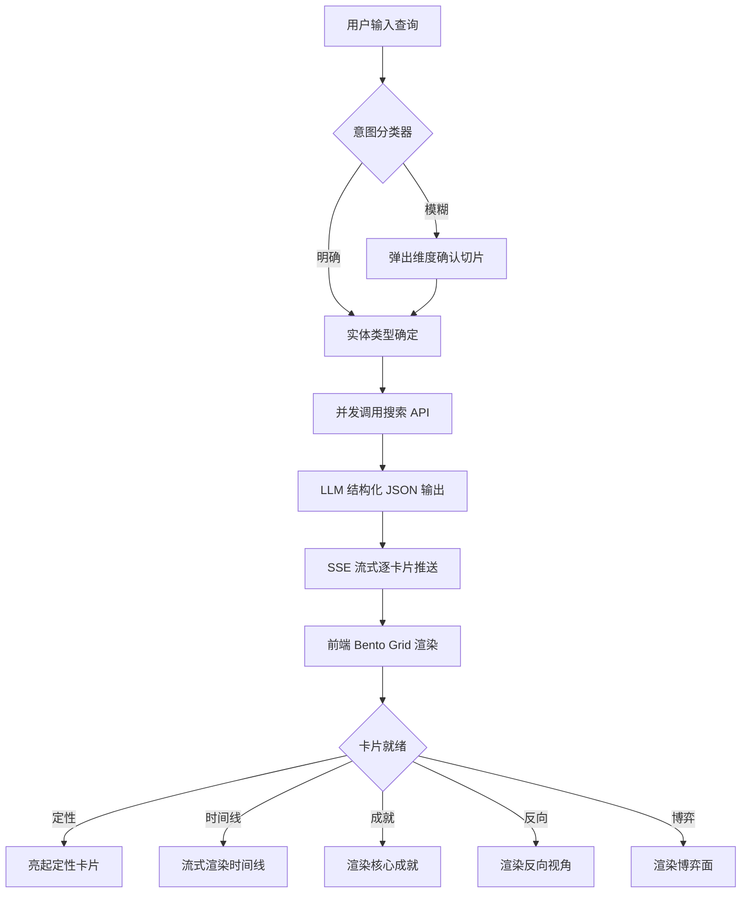

## 1. 产品概述

全知视野（OmniVision）是一款"看板即答案"的全景情报获取工具。用户输入任意人、事、物，系统在 3 秒内输出结构化情报看板，摒弃传统聊天气泡模式，直接呈现硬核数据与反向视角分析。

- **核心痛点**：现代人在信息爆炸中好奇心高频碎片化，传统搜索需多平台切换、ChatBot 文本密集缺乏视觉焦点
- **目标用户**：信息工作者、研究人员、对世界充满好奇的极客用户
- **产品价值**：将"搜索-筛选-阅读-总结"的 30 分钟流程压缩为 3 秒即时全景看板

## 2. 核心功能

### 2.1 功能模块

1. **搜索主页**：极简搜索框 + 意图确认切片 + Bento Grid 情报看板
2. **情报看板**：动态卡片流式渲染，含定性卡片、时间线、核心成就、反向视角、博弈面等

### 2.2 页面详情

| 页面名称 | 模块名称 | 功能描述 |
|-----------|-------------|---------------------|
| 搜索主页 | 搜索入口 | 居中搜索框，呼吸灯微光效果，占位符提示 |
| 搜索主页 | 意图确认切片 | 模糊输入时弹出维度确认（如"苹果"→水果/科技公司/电影） |
| 搜索主页 | Bento Grid 看板 | 激活后展开的非对称网格卡片群，毛玻璃质感 |
| 搜索主页 | 定性卡片 | 一句话定性目标本质（冷翠绿色调） |
| 搜索主页 | 时间线卡片 | 关键转折点按时间排列（极客蓝色调） |
| 搜索主页 | 核心成就卡片 | 硬核数据与正面成就（冷翠绿色调） |
| 搜索主页 | 反向视角卡片 | 争议、硬伤、槽点（猩红色调） |
| 搜索主页 | 博弈面卡片 | 利益博弈与底层逻辑（极客蓝色调） |

## 3. 核心流程

用户在搜索框输入一句话 → 后端意图分类器判断实体类型（HUMAN/EVENT/ITEM）→ 若模糊则弹出维度确认切片 → 并发调用搜索 API 抓取全网最新资讯 → LLM 结构化 JSON 输出 → SSE 流式逐卡片推送 → 前端 Bento Grid 逐块亮起渲染

## 4. 用户界面设计

### 4.1 设计风格

- **主题**：数字特工/情报机房硬核科技感
- **背景色**：深钛灰（bg-zinc-950），文字采用冷白与银灰
- **状态色系统**：
  - 核心成就/正面数据：冷翠绿（text-emerald-400 / border-emerald-500/20）
  - 黑历史/硬伤槽点/反向博弈：猩红（text-rose-400 / border-rose-500/20）
  - 底层逻辑/时间线：极客蓝（text-sky-400）
- **字体**：标题使用等宽科技感字体，正文使用简洁无衬线体
- **布局**：Bento Grid 便当盒动态看板，非对称错落网格
- **卡片质感**：毛玻璃效果（backdrop-blur-md），悬停轻微放大与光晕跟随
- **图标风格**：Lucide React 极简线性图标

### 4.2 页面设计概览

| 页面名称 | 模块名称 | UI 元素 |
|-----------|-----------|-------------|
| 搜索主页 | 初始状态 | 居中搜索框，呼吸灯微光环，深色背景带噪点纹理 |
| 搜索主页 | 激活状态 | 搜索框上移，下方展开 Bento Grid，骨架屏过渡 |
| 搜索主页 | 定性卡片 | 毛玻璃容器，翠绿边框，大字标题 + 标签 |
| 搜索主页 | 时间线卡片 | 蓝色调，垂直时间轴 + 节点标记 |
| 搜索主页 | 核心成就卡片 | 翠绿色调，数据指标 + 简短描述 |
| 搜索主页 | 反向视角卡片 | 猩红色调，警示感列表 + 关键词高亮 |
| 搜索主页 | 博弈面卡片 | 蓝色调，关系网络 / 利益分析 |

### 4.3 响应式

桌面优先设计，移动端自适应：Bento Grid 在小屏自动折叠为单列流式布局，搜索框宽度自适应。

### 4.4 动画与微交互

- 搜索框呼吸灯：CSS animation 循环微光脉冲
- 卡片入场：staggered fade-in + scale，animation-delay 递增
- 骨架屏：animate-pulse 灰色高光流线，形状对应即将出现的卡片
- 悬停效果：卡片轻微 scale(1.02) + 边框光晕增强
- 流式打字：文本内容逐字显现效果

## 5. 交互探索功能（B 阶段）

B 阶段核心目标：让用户从"被动看"变为"主动玩"，让面板成为可探索的情报沙盒。

### 5.1 B1 — 卡片点击展开深度详情

| 属性 | 内容 |
|------|------|
| 涉及卡片 | 时间线卡片、反向视角卡片、博弈面卡片（共 3 张） |
| 交互 | 点击卡片 → 卡片展开深度详情区域 → 流式渲染 LLM 二次查询结果 |
| 深度内容 | 时间线：事件完整背景、相关人物、影响链；反向视角：争议时间线、各方立场、处理结果；博弈面：博弈演进、关键转折、未来推演 |
| 后端 | 新增 `POST /api/expand` 端点，接收 cardType + payload，返回深度内容流 |
| 收起 | 再次点击卡片或按 Esc 收起 |

### 5.2 B2 — 标签关联搜索 + 面包屑历史回溯

| 属性 | 内容 |
|------|------|
| 入口 | 定性卡片底部的标签（如 #连续创业 #火星殖民）可点击 |
| 交互 | 点击标签 → 当前看板淡出 → 以该标签为新查询触发搜索 → 新看板流式渲染 |
| 面包屑 | 顶部显示查询历史路径，最多保留 5 层，可点击任意层级回溯 |
| 实现 | store 增加 `history: string[]`，SearchBar 上方渲染面包屑条 |
| 视觉 | 面包屑用 `›` 分隔，当前层级高亮，历史层级可点击 |

### 5.3 B3 — 时间线节点跳转 + 关联浮层

| 属性 | 内容 |
|------|------|
| 交互 | 点击时间线上的事件节点 → 该节点高亮放大 → 弹出关联浮层 → 其他节点变暗 |
| 关联浮层 | 显示该事件涉及的人物、影响的成就、引发的争议（从已有数据中提取关联） |
| 聚焦模式 | 其他节点 opacity 降低至 0.3，形成"聚焦"效果 |
| 实现 | 纯前端状态切换，不调用 LLM |
| 关闭 | 点击空白处或按 Esc 退出聚焦模式 |

### 5.4 B4 — 卡片内容深度追问

| 属性 | 内容 |
|------|------|
| 涉及卡片 | 定性卡片、反向视角卡片（共 2 张） |
| 交互 | 卡片右上角"追问"按钮 → 卡片内展开迷你输入框 → 用户提问 → LLM 基于该卡片上下文流式回答 |
| 上下文 | LLM 接收该卡片的完整 payload 作为上下文，确保回答聚焦 |
| 后端 | 新增 `POST /api/ask` 端点，接收 cardType + payload + question，返回流式回答 |
| 视觉 | 迷你对话框嵌入卡片底部，回答流式渲染，非全局聊天 |

### 5.5 B5 — 键盘快捷键导航

| 快捷键 | 功能 |
|--------|------|
| `1` ~ `5` | 跳转到对应卡片，卡片高亮闪烁 |
| `E` | 展开当前聚焦卡片（触发 B1 展开） |
| `Q` | 聚焦搜索框 |
| `Esc` | 关闭浮层 / 收起卡片 / 退出聚焦模式 |
| `←` `→` | 在时间线节点间切换（触发 B3 跳转） |

实现：全局 keydown 监听，忽略输入框聚焦时的按键。卡片聚焦状态由 store 管理。

## 6. 功能拓展（C 阶段）

C 阶段核心目标：让面板从"一次性看板"变成"有用的工具"，增加实用性功能。

### 6.1 C1 — 双实体对比模式（简化版）

| 属性 | 内容 |
|------|------|
| 触发 | 搜索框输入 "A vs B"、"A 对比 B"、"A 和 B" 格式 |
| 检测 | 前端检测关键词 `vs` / `对比` / `和`（用空格分隔） |
| 布局 | 上下堆叠：A 实体看板在上，B 实体看板在下，中间分隔条 |
| 后端 | 并发调用两次 `/api/search`，各自流式推送 |
| 对比摘要 | 中间分隔条显示简要对比（基于两份卡片数据的 LLM 一次性生成） |
| 视觉 | A/B 区域用不同强调色边框区分（A=翠绿，B=琥珀色） |

### 6.2 C2 — 历史档案回看

| 属性 | 内容 |
|------|------|
| 入口 | 顶部 Header 增加"档案库"按钮（Archive 图标） |
| 抽屉 | 点击后从右侧滑出抽屉面板，列出所有历史搜索 |
| 条目内容 | query + 时间戳 + 引擎模式（LIVE/MOCK）+ 实体类型标签 |
| 持久化 | localStorage 存储，key 为 `omnivision_archive`，跨会话保留 |
| 交互 | 点击条目 → 关闭抽屉 + 重新触发该查询的搜索 |
| 清空 | 抽屉底部"清空档案"按钮 |
| 入库时机 | 每次 LIVE 搜索完成后（phase → results）自动入库 |

### 6.3 C3 — 导出情报报告（HTML 打印版）

| 属性 | 内容 |
|------|------|
| 入口 | 激活态顶部增加"导出"按钮（仅 phase === 'results' 时显示） |
| 格式 | 生成可打印的 HTML 报告，保留机密档案视觉风格 |
| 报告内容 | 档案编号、查询目标、实体类型、生成时间、5 张卡片完整内容、数据源列表 |
| 导出方式 | 打开新窗口写入 HTML → 触发浏览器打印预览（用户可另存为 PDF） |
| 样式 | 内联 CSS，A4 纸张优化，深色背景转浅色打印友好 |

### 6.4 C4 — 数据源溯源

| 属性 | 内容 |
|------|------|
| 后端 | Tavily 搜索时保存来源列表（title + url），随 SSE 流推送 `sources` 事件 |
| 事件格式 | `{ sources: [{ title, url }, ...] }` 在卡片推送前发送 |
| 前端 | 档案标识条下方增加"数据源"折叠区 |
| 展开内容 | 来源列表：标题（可点击跳转原文，新标签页）+ 域名提取 |
| 折叠态 | 显示 "基于 N 个数据源生成" |
| 视觉 | 机密档案风格，每个来源带编号 `S01`、`S02`...，font-mono |

## 7. 信息层次（D 阶段）

D 阶段核心目标：让信息从扁平变立体，用可视化增加信息密度和层次感。

### 7.1 D1 — 趋势折线图（新增趋势卡片）

| 属性 | 内容 |
|------|------|
| 位置 | Bento Grid 中新增第 6 张卡片（趋势卡片），位于成就卡片之后 |
| 数据 | 后端 LLM 额外提取可量化时间序列数据（如年度交付量、营收、用户增长） |
| 数据结构 | `{ trends: Array<{ label: string, points: Array<{ x: string, y: number }> }> }` |
| 渲染 | SVG 折线图，多趋势可叠加，不同颜色区分 |
| 交互 | hover 显示具体数值和年份 |
| 容错 | LLM 返回空 trends 数组时，趋势卡片不渲染（数据密度不大的搜索自动隐藏） |
| 视觉 | 琥珀色调，背景编号 "06"，机密档案风格 |

### 7.2 D2 — 人物关系网络图（增强博弈面卡片）

| 属性 | 内容 |
|------|------|
| 改动 | 增强现有 GameplayCard 的径向网络图 |
| 新增数据 | LLM 额外生成 stakeholder 之间的关系：`{ from: string, to: string, relation: string }` |
| 关系类型 | 竞争 / 合作 / 监管 / 依赖 / 对立 等 |
| 渲染 | 节点间增加连线，不同关系类型用不同线型（实线/虚线）和颜色 |
| 交互 | 节点 hover 显示利益诉求；连线 hover 显示关系类型 |
| 布局 | 简化力导向布局（固定中心 + 圆周分布 + 连线） |

### 7.3 D3 — 多视角切换

| 属性 | 内容 |
|------|------|
| 入口 | 档案标识条下方增加视角切换按钮组 |
| 视角 | 默认（全部 5+1 张卡片）/ 正面（定性+时间线+成就）/ 反面（定性+反向视角+博弈面）/ 博弈（博弈面+反向视角） |
| 实现 | 纯前端，通过过滤 DISPLAY_ORDER 实现卡片显示/隐藏 |
| 视觉 | 按钮组用 segmented control 风格，当前视角高亮 |
| 切换 | 点击视角按钮 → 卡片淡出/淡入过渡 |

## 8. 视觉动态感（A 阶段）

A 阶段核心目标：让面板从静态展示变为动态视觉体验，增加动态感和视觉冲击力。

### 8.1 A1 — 全局背景动效

| 属性 | 内容 |
|------|------|
| 扫描线 | 整个页面周期性有一道半透明翠绿色扫描线从上到下扫过（CSS animation，8s 周期） |
| 背景粒子 | 深色背景上有缓慢漂浮的数据粒子点（Canvas，20-30 个粒子，低频运动，opacity 0.1-0.3） |
| 网格底纹 | 背景增加微弱的网格线（CSS background-image，opacity 0.03） |
| 性能 | 纯 CSS + 轻量 Canvas，不影响交互性能 |
| 层级 | z-index: -1，位于所有内容之下，pointer-events: none |

### 8.2 A2 — 卡片入场动画升级

| 属性 | 内容 |
|------|------|
| 扫描显现 | 卡片渲染时，一道扫描线从上到下扫过，扫过区域内容从透明渐显 |
| 角标展开 | corner-brackets 从中心向外展开（scale 0→1 + opacity 0→1） |
| 数据滑入 | 卡片内容从右侧滑入（translateX 20px→0 + opacity 0→1） |
| 时序 | 角标展开(300ms) → 扫描显现(500ms) → 数据滑入(400ms)，总 1200ms |
| 触发 | 每张卡片首次渲染时触发（staggered delay 递增） |

### 8.3 A3 — 实时数据脉冲指示器

| 属性 | 内容 |
|------|------|
| 引擎脉冲 | LIVE/MOCK 标识增加心跳脉冲动画（scale 1→1.3→1，2s 周期） |
| 数字滚动 | 数据源数量从 0 滚动到 N（requestAnimationFrame，800ms） |
| 流式指示 | 搜索中时顶部显示 "DATA STREAMING..." + 流动光点动画（3 个点依次闪烁） |
| 卡片脉冲 | 每张卡片右下角微弱脉冲点（翠绿色，2s 周期，opacity 0.3→0.8→0.3） |
