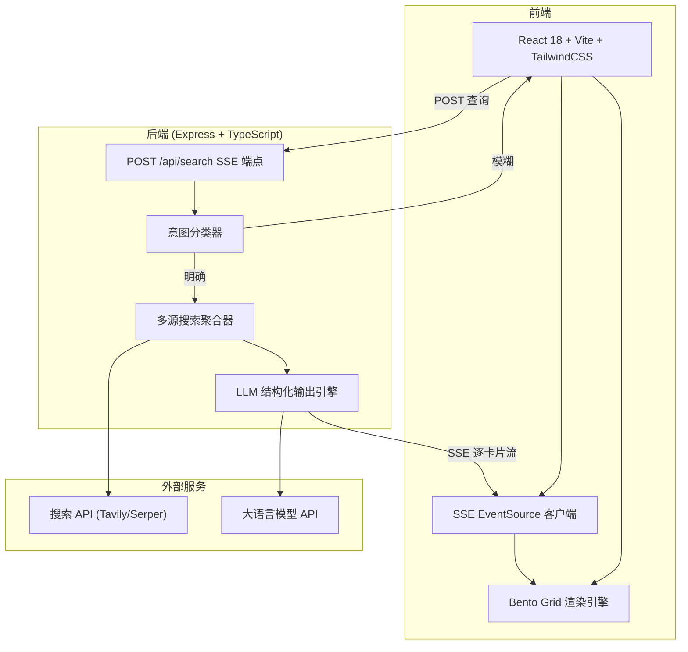
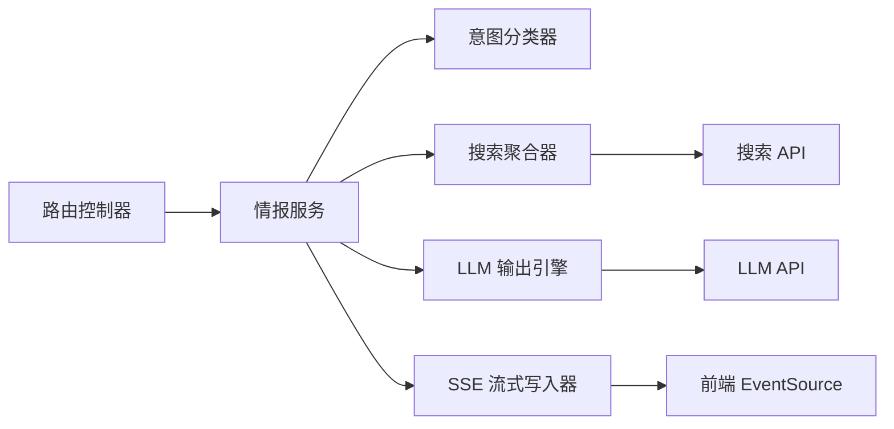

## 1. 架构设计



> **架构说明**：原蓝图指定 FastAPI (Python) 后端。本 Demo 基于 web-dev 技术栈规范，适配为 Express.js (TypeScript) 后端，功能等价：Express 原生支持异步并发与 SSE 流式推送，Zod 替代 Pydantic 做结构化校验，Node fetch 替代 HTTPX 做异步网络请求。

## 2. 技术说明

- **前端**：React@18 + tailwindcss@3 + vite
- **初始化工具**：vite-init (react-express-ts 模板)
- **后端**：Express@4 (TypeScript, ESM)
- **数据库**：无（纯实时查询，不持久化）
- **结构化校验**：Zod（替代 Pydantic，约束 LLM 输出 JSON schema）
- **图标库**：lucide-react
- **Markdown 渲染**：react-markdown
- **状态管理**：zustand

## 3. 路由定义

| 路由 | 用途 |
|-------|---------|
| / | 搜索主页（搜索框 + Bento Grid 看板） |

## 4. API 定义

### 4.1 SSE 搜索端点

```typescript
// POST /api/search
// Request
interface SearchRequest {
  query: string;          // 用户输入
  entityType?: EntityType; // 意图确认后指定的类型
}

type EntityType = 'HUMAN' | 'EVENT' | 'ITEM';

// Response: SSE 流（Content-Type: text/event-stream）
// 逐卡片推送，每条消息格式：
interface SSECardEvent {
  event: 'card';
  data: {
    cardType: CardType;
    payload: CardData;
  };
}

type CardType = 'verdict' | 'timeline' | 'achievements' | 'darkside' | 'gameplay';

// 定性卡片
interface VerdictCard {
  title: string;        // 一句话定性
  subtitle: string;     // 补充说明
  tags: string[];       // 标签
}

// 时间线卡片
interface TimelineCard {
  events: Array<{
    year: string;
    title: string;
    description: string;
  }>;
}

// 核心成就卡片
interface AchievementsCard {
  items: Array<{
    metric: string;
    label: string;
    context?: string;
  }>;
}

// 反向视角卡片
interface DarksideCard {
  controversies: Array<{
    title: string;
    detail: string;
    severity: 'high' | 'medium' | 'low';
  }>;
}

// 博弈面卡片
interface GameplayCard {
  stakeholders: Array<{
    name: string;
    position: string;
    interest: string;
  }>;
  dynamics: string; // 底层逻辑总结
}
```

### 4.2 意图确认端点

```typescript
// POST /api/clarify
// 当意图模糊时，返回候选维度
interface ClarifyRequest {
  query: string;
}

interface ClarifyResponse {
  options: Array<{
    label: string;       // 如 "🍎 水果"
    entityType: EntityType;
    description: string;
  }>;
}
```

## 5. 服务架构图



## 6. 数据模型

本系统为纯实时查询系统，不使用数据库持久化。所有数据通过搜索 API 和 LLM 实时获取，通过 SSE 流式推送到前端后由 zustand 管理前端状态。

### 6.1 前端状态模型

```typescript
// zustand store
interface OmniVisionStore {
  phase: 'idle' | 'clarifying' | 'searching' | 'results';
  query: string;
  clarifyOptions: ClarifyOption[];
  cards: Record<CardType, CardData | null>;
  streamingCards: CardType[]; // 正在流式渲染的卡片顺序

  setQuery: (q: string) => void;
  startSearch: () => void;
  addCard: (type: CardType, data: CardData) => void;
  reset: () => void;
}
```

### 6.2 后端 LLM Prompt 约束

```
SYSTEM: 你是全知视野情报引擎。根据搜索结果，输出结构化 JSON。
禁止输出任何客套话、前言、过渡语。直接输出 JSON。
强制引入"反向视角"：必须包含争议、硬伤或利益博弈分析。

USER: 实体类型: {entityType}
      搜索结果: {searchResults}
      输出 schema: {jsonSchema}
```
